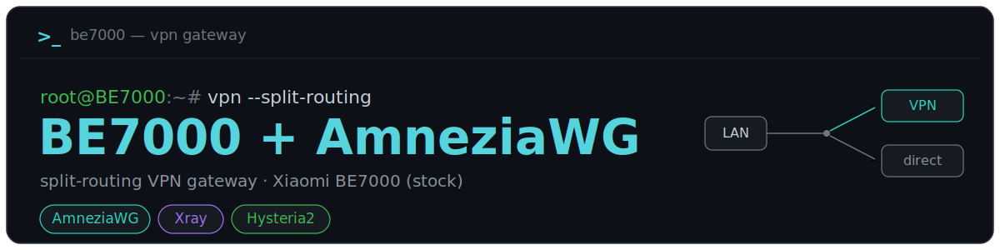
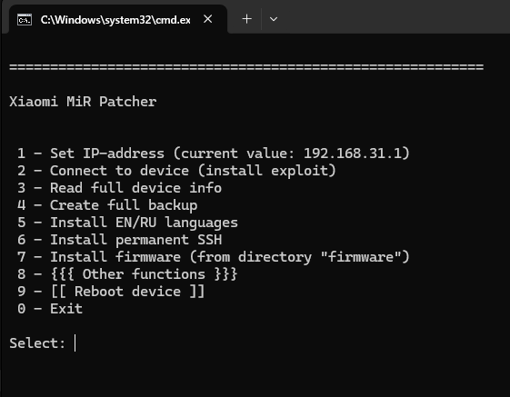
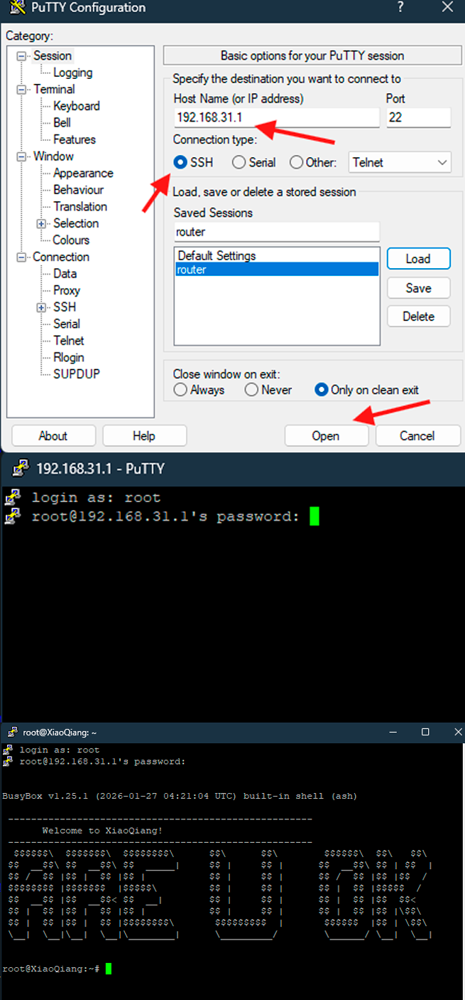
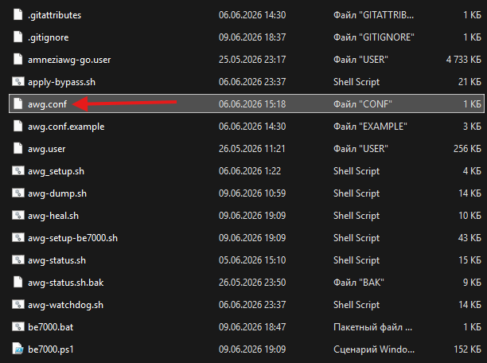
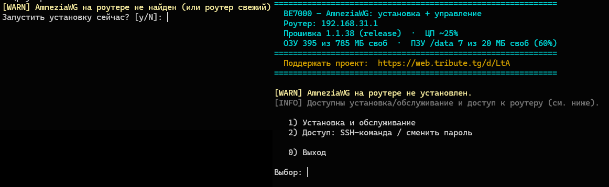
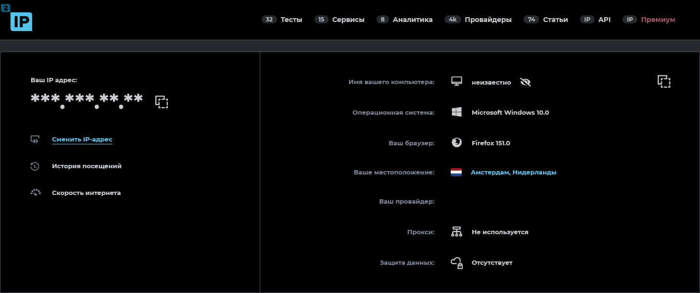
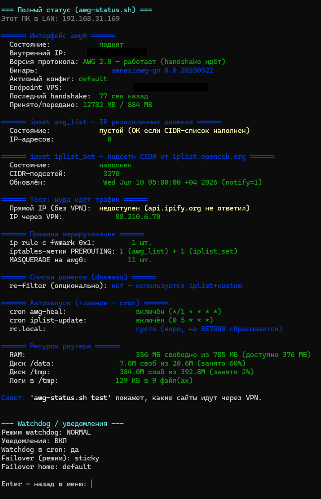
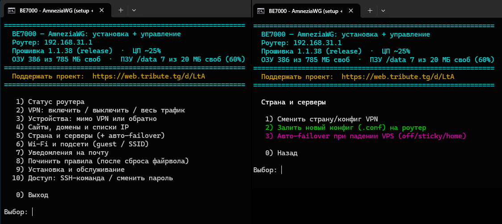
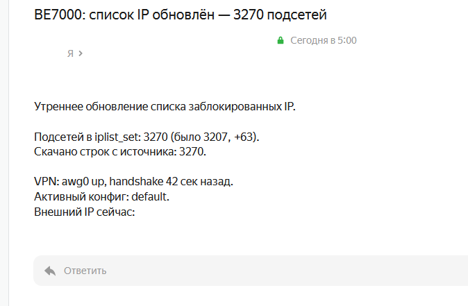

### Split-routing VPN gateway for Xiaomi BE7000

🌐 **English** · 🇷🇺 [Русская версия](README.md)

This project turns a **Xiaomi BE7000 router (Chinese version, stock firmware)** into a flexible
VPN gateway with **split routing**: traffic to the services you choose (by IP and domain lists)
goes through your own server over [AmneziaWG](https://github.com/amnezia-vpn), while everything
else goes **directly**, with no extra hop and no speed loss.

In essence it's **control over routing and privacy in your own home network**: set it up on the
router once, and the rules apply to every device behind it — no VPN apps on each one. Management is
**a single file on your computer** (Windows).

> **Who it's for.** This README is written for a regular user: you want a VPN on your router and
> you don't have to understand the internals. Follow the steps top to bottom — that's enough. The
> scripts themselves are heavily commented (they explain the "why") if you want to dig deeper.

> 💛 **The project is free and open.** If it saves your day — there's a way to say thanks:
> [**support the author**](#12-support-the-author).

---

## Table of contents

1. [What it is and what you get](#1-what-it-is-and-what-you-get)
2. [Glossary (5 terms in plain words)](#2-glossary-5-terms-in-plain-words)
3. [⚠️ Read before installing](#3-read-before-installing)
4. [What you'll need](#4-what-youll-need)
5. [Step-by-step installation](#5-step-by-step-installation)
   - [Step 1. Open root SSH access on the router](#step-1-open-root-ssh-access-on-the-router)
   - [Step 2. Install the programs on your computer](#step-2-install-the-programs-on-your-computer)
   - [Step 3. Download the project](#step-3-download-the-project)
   - [Step 4. Prepare the VPN config (`awg.conf`)](#step-4-prepare-the-vpn-config-awgconf)
   - [Step 5. Run the installation](#step-5-run-the-installation)
   - [Step 6. Check that the VPN works](#step-6-check-that-the-vpn-works)
6. [Day-to-day management](#6-day-to-day-management)
7. [If something went wrong](#7-if-something-went-wrong)
8. [How it works (for the curious)](#8-how-it-works-for-the-curious)
9. [About AmneziaWG 2.0 and the binaries](#9-about-amneziawg-20-and-the-binaries)
10. [Security and privacy](#10-security-and-privacy)
11. [Acknowledgements](#11-acknowledgements)
12. [Support the author ❤️](#12-support-the-author)

---

## 1. What it is and what you get

After installation, your BE7000 will have:

- **Split routing.** The services you pick (by IP/domain lists) go through your server, the rest
  goes directly. No need to push all traffic through a single point.
- **AmneziaWG plus an alternative transport of your choice: Xray (VLESS/Reality) or Hysteria2 (QUIC).**
  A single toggle switches the protocol for the whole home — your shared routing rules (what goes
  through the VPN) are kept. Handy as a fallback: if AmneziaWG starts getting throttled by DPI, switch
  to the alt. Xray configs are added by a `vless://` link (SNI/fingerprint editable from the PC),
  Hysteria2 by a `hy2://` link. The flash holds one alt — Xray OR Hysteria2 (you choose at install).
- **One control panel on your PC.** The `be7000.bat` file opens a menu: turn the VPN on/off, add a
  domain to the tunnel, route a specific device around the VPN, switch countries, check status,
  and so on. No manual commands on the router.
- **Self-healing.** After the router reboots, the VPN comes back up by itself. All your exclusion
  settings survive both a reboot and a firewall reset.
- **Watchdog.** If the server becomes unreachable, the router notices and either switches to a
  backup or temporarily routes traffic directly (so the internet doesn't disappear entirely).
- **Email notifications** (optional) — "VPN down / restored" messages, plus a morning summary.

What the project does **not** do: it does not give you the server itself — you bring your own VPS
with AmneziaWG (or a ready-made config from one). See [Step 4](#step-4-prepare-the-vpn-config-awgconf).

---

## 2. Glossary (5 terms in plain words)

Expand — if VPS, AmneziaWG, config, SSH are unfamiliar words

- **VPS** — a rented server. Your chosen VPN traffic goes out through it. Usually costs a couple
  of dollars a month. It's your "exit point" to the internet.
- **AmneziaWG** — WireGuard with obfuscation: the same fast VPN, but its traffic is
  indistinguishable from ordinary HTTPS. Because of that it works reliably where plain WireGuard
  is recognized and throttled (corporate, hotel, mobile networks). This is what runs on the router.
- **Config (`awg.conf`)** — a text file with the keys and the address of your VPS. Essentially the
  "login/password" for connecting to the server. You bring it from your own VPS/app.
- **Split tunneling** — the "part of the traffic through the VPN, part directly" mode. You decide
  what goes where, by IP/domain lists; everything else takes the direct route.
- **SSH** — a way to manage the router from your computer over the network, like a "remote command
  line". The installer needs it to upload and configure the scripts.

---

## 3. Read before installing

- **Xiaomi BE7000 only, Chinese (CN) version, stock firmware.** Development and testing were done on
  **stock firmware 1.1.38 (release)**; it hasn't been tested on lower/higher versions, other models
  or firmware and isn't guaranteed to work there.
- **This modifies your router.** The scripts change routing, iptables, DNS and cron. There are
  safeguards (watchdog, emergency shutoff, self-healing), but a wrong configuration can leave you
  temporarily without internet. Keep access to the router handy and don't do this "on the run"
  right before an important meeting.
- **DNS is the weak spot.** A single shared DNS sends queries into the tunnel. If the server
  suddenly becomes unreachable, sites may fail to open across all networks until the watchdog kicks
  in (up to 2 minutes); then the watchdog switches DNS to a public resolver and traffic goes
  directly. This is expected behavior.
- **Don't publish your secrets.** The `awg.conf`, `configs/*.conf` and `notify.conf` files contain
  private keys and passwords. They're already in `.gitignore` — only the `*.example` templates go
  into the repository. Never send anyone your `awg.conf`.
- **A from-scratch install has been verified once on the author's hardware** (BE7000, firmware 1.1.38).
  The project is still early (0.x) — other setups may hit rough edges and need manual tweaks. If
  installing from scratch, keep router access handy.
- **No warranty, at your own risk.** Much of this is verified only on live hardware.

---

## 4. What you'll need

### Router
- **Xiaomi BE7000**, Chinese (CN) version, **stock** firmware (tested on **1.1.38 release**).
- Open **root SSH access** — how to get it is described in [Step 1](#step-1-open-root-ssh-access-on-the-router).
- Everything else (busybox, iptables/ipset, ARM64) is already on the router.

### A server (VPS) or a ready-made config
- Your own **VPS with AmneziaWG** *or* a ready-made client config from the **AmneziaVPN** app.
- The file format is `awg.conf` (see [awg.conf.example](awg.conf.example)). More in [Step 4](#step-4-prepare-the-vpn-config-awgconf).

### A computer (for installation and management)
- **Windows 10/11**, PowerShell 5+ (tested on Russian-locale Windows).

### Programs you'll need along the way (with links)
| Program | What for | Where to get it |
|---|---|---|
| **PuTTY** (`plink`/`pscp`) | PC ↔ router link, file upload | <https://www.putty.org/> |
| **xmir-patcher** | open root SSH on stock firmware | <https://github.com/openwrt-xiaomi/xmir-patcher> |
| **Python 3** | required to run xmir-patcher | <https://www.python.org/downloads/> |
| **AmneziaVPN** (optional) | create/export the `awg.conf` config | <https://github.com/amnezia-vpn> |

---

## 5. Step-by-step installation

### Step 1. Open root SSH access on the router

On stock firmware SSH is closed. It's opened with the free, open **xmir-patcher** utility (used by
the entire BE7000 community). In short:

> ⚠️ **Make a backup before flashing.** xmir-patcher can save the factory firmware and settings —
> be sure to do this **before** any changes (the step is covered in its instructions). It's your
> insurance against a "brick" if something goes wrong.

1. Install **Python 3** (<https://www.python.org/downloads/>), and during installation check
   "Add Python to PATH".
2. Download **xmir-patcher** (<https://github.com/openwrt-xiaomi/xmir-patcher>) and run it
   **per the instructions in its own repository** (which also cover backups and the quirks of the
   Chinese firmware). The utility connects to the router and **enables SSH**.
3. After that you can log into the router over SSH. **The default login and password are `root` / `root`.**

*xmir-patcher connects to the router and enables SSH — follow the instructions in its own repository.*

> 🔒 **Change the `root` password immediately.** The default `root/root` is known to the whole
> internet — leaving it is unsafe. Change the router's actual root password with **xmir-patcher**
> (the same tool that opened SSH — see its instructions). The project's **Access → change password**
> menu item changes **not** the router's password but only the password the script uses to log in
> over SSH — update it there **after** you've changed the password on the router.

To check that SSH works: in PuTTY (or `plink`) connect to `192.168.31.1` as `root` (we install
PuTTY in [Step 2](#step-2-install-the-programs-on-your-computer) — you can verify from there too).
If you get in, move on to step 2. This is the most "technical" step of the whole installation; it
gets easier from here.

*If you see the router prompt — SSH is open, you can move on.*

### Step 2. Install the programs on your computer

Install **PuTTY** (<https://www.putty.org/>). You need two files from the bundle: `plink.exe`
and `pscp.exe`. The easiest way is the full installer — then they end up on your `PATH`.

### Step 3. Download the project

The project itself is the set of files in the [github.com/Axel173/xiaomi-be7000-amnezia](https://github.com/Axel173/xiaomi-be7000-amnezia) repository (where this README lives, too).

1. On the [project page](https://github.com/Axel173/xiaomi-be7000-amnezia), click the green **Code** button, then **Download ZIP**
   (or `git clone https://github.com/Axel173/xiaomi-be7000-amnezia.git` if you're comfortable with git).
2. Unpack the archive into any folder, for example `D:\be7000`.
3. All further management happens from this folder (it contains `be7000.bat`).

### Step 4. Prepare the VPN config (`awg.conf`)

You need a single file — `awg.conf` with the keys and the address of your server.

**Where to get it:**
- **Your own VPS with AmneziaWG** (recommended) — bring up an AmneziaWG server and export the
  client config. A convenient path is the **AmneziaVPN** app (<https://github.com/amnezia-vpn>),
  "your own server" mode: it deploys AmneziaWG on your VPS itself and hands you the config.
- **A ready-made config** from any source that supports AmneziaWG.

> ⚠️ **When exporting from AmneziaVPN, pick the "native" AmneziaWG / WireGuard format** — a text
> config with `[Interface]` and `[Peer]` sections, **not the "for the AmneziaVPN app" format**. The
> router can't read the "for the app" format: the tunnel will even come up and handshake, but with
> no IP address on the interface no traffic flows (symptom — sites don't open, `received` near zero).

> **Don't have a VPS yet?** You'll need a server in any case. A couple of tested hosts (referral
> links, same price for you) are at the end, in the [Support the author](#12-support-the-author) section.

**What to do — it's just copying a file in the file explorer:**
1. Find your config — a text file with `[Interface]` and `[Peer]` sections (issued by the VPS or
   exported by the AmneziaVPN app).
2. **Copy it into the project folder** (where `be7000.bat` is) and **rename the copy to
   `awg.conf`**. That's it.

   ⚠️ **Windows hides file extensions.** Make sure the name came out as exactly `awg.conf`, not
   `awg.conf.txt`. If you're not sure — enable "Show file name extensions" in the file explorer and check.

3. *(Optional.)* Open `awg.conf` in Notepad and compare it with
   [awg.conf.example](awg.conf.example) — the comments there explain what each field does. Usually
   you don't need to change anything; edit only if you're assembling the config by hand.

*Extensions on, the file is named `awg.conf` (not `awg.conf.txt`) and sits next to `be7000.bat`.*

**Multiple countries/servers?** Copy them into the `configs/` folder the same way and name them by
country — `configs/germany.conf`, `configs/finland.conf`, etc. Switching is done from the menu
(change country), and you can also enable automatic failover to a backup if the main server goes down.

### Step 5. Run the installation

1. Double-click **`be7000.bat`** (it's in the project root).
2. The script checks the router itself: it sees that AmneziaWG isn't installed yet and **offers to
   install it**. Agree — it uploads all the needed files to the router and starts the setup. (If you
   want to be explicit — that's **Install and maintenance → Install/reinstall AmneziaWG**.)
3. Along the way it asks for the **source of the IP-subnet list** (you can leave the default) and
   asks for confirmations. Just follow the on-screen prompts.

> **If your router isn't on `192.168.31.1`.** On the very first run `be7000.bat` asks for the
> router's IP address (press Enter to keep the default `192.168.31.1`). If your router is on a
> different subnet (e.g. `192.168.31.100`), enter your address — otherwise the script can't reach
> it and reports "router unavailable". Change it later: **Access → Change router IP address**.

On the first run it asks for the router's SSH password (the one you set in Step 1). It's stored
encrypted (Windows DPAPI), so you won't have to enter it again.

*The first-run screen: the install offer.*

### Step 6. Check that the VPN works

From a device connected to the router:

1. **Main check — open the service you set up the VPN for** (the one that lands in the tunnel by the
   IP/domain lists): it should open and work through the server.
2. **Local sites go directly.** Open a site that should bypass the VPN — it should work **directly**,
   fast, without the VPN.
3. *(If you want to see the server's country explicitly.)* "What's my IP" services (2ip.ru and the
   like) show **your ISP** under split routing — that's normal, such traffic goes directly. To check
   the tunnel itself, briefly enable **VPN: on / off / all traffic → send all traffic into the
   tunnel**, open <https://2ip.ru> — now it shows **your VPS's country and IP**. Done — switch the
   mode back.

*With "all traffic into the tunnel" on, 2ip.ru shows your VPS's country/IP — the tunnel really carries traffic.*

If something is off — see the [next section](#7-if-something-went-wrong). A quick status is the
**Status** category, and full diagnostics live under **Install and maintenance → Installation diagnostics**.

*The "Status" category — a health check on one screen: link to the VPS, current server, exclusions, resources.*

> 🎉 **Working?** If the project saved you time and nerves — that's a great reason to
> [**support the author**](#12-support-the-author). That's how it stays alive and keeps growing
> (and the lists and scripts stay up to date).

---

## 6. Day-to-day management

Everything is managed from the menu opened by the same **`be7000.bat`**. The menu is two-level:
first you pick a **category**, then an action inside it (numbering restarts from 1 in each
section). Briefly, by section:

*The header shows firmware, CPU load and memory; below — the list of categories.*

| Section | What it can do |
|---|---|
| **Status** | Full status: connection, IP, current exclusions |
| **VPN: on / off / all traffic** | Turn the whole VPN on/off; send all traffic, or a specific network, **entirely** into the tunnel |
| **Devices around VPN / back** | Route a specific device (by its LAN IP) around the VPN, and back |
| **Sites, domains and IP lists** | Add/remove a domain, search; route a site (IP/subnet) around the VPN or back; choose the CIDR-list source (opencck, **any custom URL**, or **your own file** — only/merge) |
| **Country and servers** | Switch country/config, upload a new `.conf`, auto-failover to a backup server |
| **Wi-Fi and subnets** | Network status; route the guest network or a specific SSID around the VPN |
| **Email notifications** | Set up email alerts when the VPN goes down/recovers |
| **Repair rules** | Restore rules after a firewall reset (e.g. from the Xiaomi web UI) |
| **Install and maintenance** | Install/update, backup/rollback, uninstall, diagnostics, diagnostic dump |
| **Access** | Change the router's SSH password, raw SSH command |

> **The menu header** shows the router's firmware, CPU load and memory. Until AmneziaWG is installed
> (or if the router is unreachable), only "Install and maintenance" and "Access" are shown.

> **Your exclusions are not lost.** Everything you routed around the VPN or sent into it (devices,
> services, SSIDs, the guest network) is stored on the router in persistent memory and **survives a
> reboot and a firewall reset** — self-healing replays them at boot.

*An example email (the "Email notifications" category): an event plus brief details, so you learn about a VPN drop/recovery without walking over to the router.*

> **How to set up email.** You need a Yandex mailbox and an **app password** (not your main account
> password): enable mail-protocol access in [Yandex Mail settings](https://yandex.ru/support/yandex-360/customers/mail/ru/mail-clients/others),
> then create an [app password](https://id.yandex.ru/security/app-passwords). Enter it in
> **Email notifications → Set up email**.

---

## 7. If something went wrong

- **No internet after install / the services you need won't open.** Most often it's either a
  dead/incorrect VPS config or firewall rules that got wiped. Go to the **Repair rules** category,
  then check **Status**. If the main server is unreachable, the installer itself tries to
  fail over to a backup or to direct mode.
- **The VPN was there, then disappeared.** The watchdog fired — the server probably became
  unreachable. Check the VPS; meanwhile the router keeps the internet flowing directly (`safety_off`).
- **The installer can't log into the router.** Check that SSH is open (Step 1) and the password is
  correct (change it under **Access → change password**). At startup `be7000.bat`
  pings the router and port 22 and will tell you if it's closed.
- **Want a full snapshot for troubleshooting?** The **Install and maintenance → Save diagnostics to
  a file** action collects logs and state into a single local text file (keys and public IPs are
  masked) — handy to attach to a question in the community chat.
- **Mi Home can't see the router / smart devices act up.** A known quirk: it's only cured by turning
  the VPN off entirely for a while (**VPN: on / off / all traffic → Turn the whole VPN off**).
- **Didn't find an answer?** Ask in the BE7000 community — the Telegram chat
  [@xiaomi_be7000](https://t.me/xiaomi_be7000), where a lot of experience with this router has piled up.

---

## 8. How it works (for the curious)

Expand the technical description

- **Two sides.** PC: `be7000.bat` → `be7000.ps1` (PowerShell, talks to the router via `plink`/`pscp`
  from PuTTY). Router: a set of `*.sh` scripts on busybox in `/data/usr/app/awg/`.
- **Routing.** Marked traffic (`fwmark 0x1`) goes into a separate routing table with
  `default dev awg0` (the tunnel). Marking is done by two lists (ipset): domains (fed by dnsmasq) and
  CIDR lists of popular foreign services (Cloudflare, Spotify, Steam, Netflix, etc.).
- **The CIDR-list source is configurable.** By default it's the full opencck list; you can narrow it
  to specific sites, point it at **any custom URL** (anything that returns CIDR/IP per line), or use
  **your own local file**: mode `only` (just your file, no internet) or `merge` (opencck/URL + your
  file on top). The file lives on the router and survives reboots.
- **"Around the VPN" exclusions.** A separate `VPN_EXCLUDE` chain (with `-j ACCEPT`), checked first.
  For a device, its rules can physically only push traffic **directly**, never into the tunnel, so
  they can't "take the internet down".
- **Reliability.** `awg-heal` brings the VPN up after a reboot; `awg-watchdog` monitors liveness and
  performs auto-failover to backup configs; the IP lists update atomically (a source failure doesn't
  break routing); and you get emails about events.

Even deeper — in the detailed comments inside the scripts themselves (`*.sh`): they describe the
"why", not just the "what".

---

## 9. About AmneziaWG 2.0 and the binaries

**You don't need to compile anything.** Ready-made ARM64 binaries are already included — the
`amneziawg-go` daemon and the `awg` utility (the `*.user` files in the repository); the installer
uploads them to the router itself. They're built for **AmneziaWG 2.0**, so fresh configs from the
AmneziaVPN app work out of the box.

If you ever want to build the binaries yourself (Go + musl) — the sources are in the
[amnezia-vpn/amneziawg-go](https://github.com/amnezia-vpn/amneziawg-go) repository. For ordinary use
this isn't required.

---

## 10. Security and privacy

- **Change the default `root/root` password** right after opening SSH — with **xmir-patcher**
  (see its instructions). That's the first and most important thing. The **Access → change password**
  menu item, in turn, changes not the router's password but only the script's saved SSH login
  password — update it there afterwards.
- **Don't publish your `awg.conf`/`configs/*.conf`/`notify.conf`** — they hold private keys and
  passwords. The repository has only the `*.example` templates; your secrets are in `.gitignore`.
- **The SSH password on the PC is stored encrypted** via Windows DPAPI (tied to your account).
- **What changes on the router:** routing, iptables rules, DNS settings (dnsmasq) and a couple of
  cron jobs (self-healing and the watchdog). All of it is removed by the standard uninstall
  (**Install and maintenance → Remove AWG from the router**).
- **The diagnostic dump (Install and maintenance → Save diagnostics to a file) is built to be
  shareable:** it never reads the secret config files and masks keys and public IPs. Still, glance
  over the file before posting it publicly — the masking is heuristic.

---

## 11. Acknowledgements

The project stands on the shoulders of others' work — thank you:

- **[Amnezia](https://github.com/amnezia-vpn)** — AmneziaWG / `amneziawg-go`: WireGuard obfuscation
  — traffic is disguised as ordinary HTTPS, which keeps it stable in networks where plain WireGuard
  is throttled.
- **[alexandershalin](https://github.com/alexandershalin/amneziawg-be7000)** —
  `awg_setup.sh`, the AmneziaWG installation script for BE7000 routers (vendored into this repository).
- **[opencck / iplist](https://iplist.opencck.org)** (based on
  [rekryt/iplist](https://github.com/rekryt/iplist)) — up-to-date CIDR lists of major foreign
  services (Cloudflare, Spotify, Steam, Netflix, etc.).
- **[ITDog — allow-domains](https://github.com/itdoginfo/allow-domains)** — ready-made domain lists
  for routing.
- **[xmir-patcher](https://github.com/openwrt-xiaomi/xmir-patcher)** — opening root SSH on stock
  Xiaomi firmware.
- **[PuTTY](https://www.putty.org/)** — `plink`/`pscp`, the transport from the PC to the router.
- **The [@xiaomi_be7000](https://t.me/xiaomi_be7000) community** — collective experience with this
  router, without which half the pitfalls would have been unavoidable.

---

## 12. Support the author

The project is **free and open-source**, and there's a lot of manual work behind it: debugging on
live hardware, maintaining the lists and scripts, documentation.

If it saved you **time and nerves** or was simply useful — here's how to say thanks:

**One-time donation via Telegram:**
- 💬 **Telegram (Tribute)** — [web.tribute.tg/d/LtA](https://web.tribute.tg/d/LtA) (by card)
- 💎 **Telegram (Tribute, crypto)** — [t.me/tribute](https://t.me/tribute/app?startapp=dLtA) (crypto, right inside Telegram)

**With cryptocurrency** (several networks to choose from — the donor picks the convenient one):
<!-- One address per network, the network's tokens share it:
       ETH + USDT-ERC20      → one Ethereum address (0x…)
       TRX + USDT-TRC20      → one TRON address (T…)
       Toncoin + USDT-TON    → one TON address (UQ…)
     Cheap for the donor: TON and USDT-TON (~a cent), SOL (fractions of a cent), TRX. Pricier: BTC, ETH, USDT-ERC20. Addresses verified by checksum. -->
- ₿ **Bitcoin (BTC)** — `bc1q5wdv30gdnsc95dkju6zkenjjcsnfs0z77wxhsh`
- Ξ **Ethereum (ETH)** — `0x6558410D16A2937c7B7eF7E447013ddEadf11e4e`
- ₮ **USDT** — **TON** network — `UQDkGR4JuzMN1cUg_5ehYf5RFRSbvs7ynjeOdPCyC72F8r3a`
- ₮ **USDT** — **TRC-20** (TRON) network — `TKPAFNRJUx6zcYTeCrAEBjFoWhuPUDyBG8`
- ₮ **USDT** — **ERC-20** (Ethereum) network — `0x6558410D16A2937c7B7eF7E447013ddEadf11e4e`
- 💎 **Toncoin (TON)** — `UQDkGR4JuzMN1cUg_5ehYf5RFRSbvs7ynjeOdPCyC72F8r3a`
- 🔺 **TRON (TRX)** — `TKPAFNRJUx6zcYTeCrAEBjFoWhuPUDyBG8`
- ◎ **Solana (SOL)** — `Eq48vnUcJn8yxmAtmyZJ4wmGW3TJaMhRdZkRJi1VULYx`

**Getting a VPS for the project? Use a referral link:**
you need a server anyway (see [What you'll need](#4-what-youll-need)) — if you sign up through a
link below, the author gets a small bonus, **and the price stays the same for you** (with VDSina — even at a discount).
- 🖥️ **[MegaHost](https://megahost.kz/?from=16375)** (referral link) — VPS and hosting in Kazakhstan (own data centers, a registrar since 2009)
- 🖥️ **[JustHost](https://justhost.asia/?ref=232764)** (referral link) — VPS in many locations worldwide (you can pick the server's country)
- 🖥️ **[VDSina](https://www.vdsina.com/?partner=x8rv7m67wj)** (referral link) — affordable VPS with hourly billing; this link gives **you a 10% discount**. _(No discount but a bigger bonus to the author — [alternative link](https://www.vdsina.com/?partner=7i8wuiy8x5).)_

Thank you!
